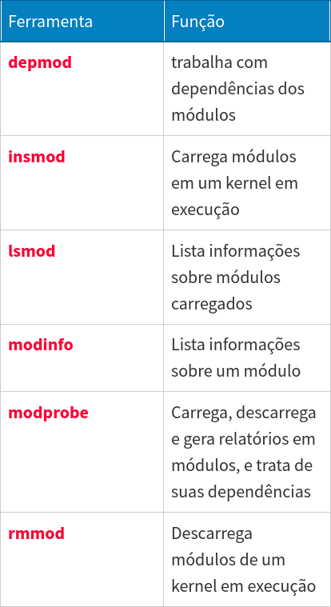

# Ferramentas para Gerenciamento de Módulo

Listamos abaixo algumas ferramentas usadas para gerenciamento de módulo no linux:



# lsmod e modinfo

ldmod é usado para verificar os módulos carregados atualmente no sistema.

modinfo traz informações sobre um módulo específico

```
lsmod | less 
```
Mostra os módulos carregados

```
modinfo psmouse
```
Mostra infos sobre o módulo psmouse

# insmod

Insere um módulo no kernel em execução.
Não leva dependências em consideração. Se o módulo depender de outro módulo ou de outro arquivo de biblioeteca a operação irá falhar

Exemplo:
Inserir o módulo **fat**:
```
insmod [caminho_do_modulo]
```

```
insmod /lib/modules/<versão_kernel>/kernel/fs/fat/fat.ko
```

# rmmod

Remove módulos do kernel em execução. (Não necessita caminho completo)

Exemplo:
```
rmmod fat
```

# depmod

Gera um mapa de dependências dos módulo.
Recomendado rodá-lo antes de usar o comando modprobe para trabalhar com os módulos

Ex.:
```
depmod --all --verbose
```

# modprobe

Permite inserir módulos no sistema com funcionalidades adicionais, e também remover módulos (com a opção -r). Leva em consideração as dependências.

Exemplos:
```
modprobe msdos
```
Carrega o módulo msdos

```
modprobe -r msdos fat
```
Remove o módulo msdos e fat

```
modprobe --show-depends cdrom
```
Mostra dependências do módulo cdrom
