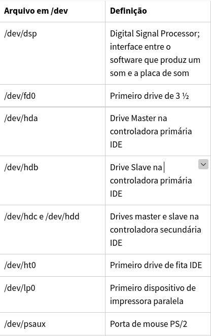
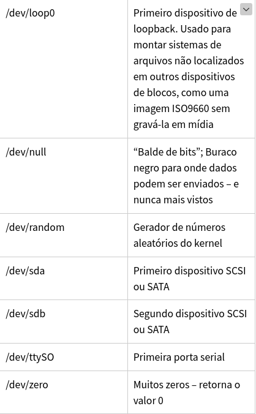

A estrutura dos sistemas de arquivos do Linux é definida por um padrão denominado **Filesystem Hierarchy Standard** (Padrão de Hierarquia do Sistema de Arquivos), a qual define também as estruturas de outros sistemas como o BSD, por exemplo.


O Filesystem Hierarchy Standard (**FHS**) evoluiu a partir de padrões históricos originados de versões mais antigas do UNIX, como a Berkeley Software Distribution (BSD) e outras. O **FHS** fornece aos desenvolvedores Linux e administradores de sistemas uma estrutura de diretórios padrão para o sistema de arquivos, trazendo consistência entre sistemas e distribuições.


No site http://www.pathname.com/fhs/ podemos acessar o documento padrão FHS e baixá-los para consulta e estudo.


A página oficial do projeto é http://www.linuxfoundation.org/collaborate/workgroups/lsb/fhs


# / – O diretório Root (Raiz)


Tudo o que há no seu sistema Linux fica localizado dentro do diretório raiz, representado por **/**. É como se fosse um **“C:\”** do Windows, porém **outras partições** e discos também se localizam sob o diretório raiz no Linux, enquanto no Windows cada partição teria sua própria letra de unidade separada. No Linux, as demais partições se encontram “**montadas**” em **pastas** dentro da hierarquia de diretórios, sob a raiz (**/**).


Você pode ver diretório raiz do Linux e seu conteúdo básico, listado com o comando
```
 tree -L 1
```

```
tree -d -L 1
```

# /bin – Binários essenciais dos usuários


O diretório **/bin** contém binários **essenciais aos usuários** – ou seja, programas – que precisam estar presentes quando o sistema é inicializado no modo monousuário. **Aplicativos comuns**,como navegadores e jogos geralmente se localizam no diretório **/usr/bin**, ao passo que programas e utilitários importantes são armazenados no diretório **/bin**.


O diretório **/bin** contém **binários executáveis**, **comandos essenciais** que são utilizados quando em modo monousuário e também muitos comandos essenciais que são requeridos por todos os usuários do sistema, tais como ls, **rmdir** e **date**.


Já os comandos que **não são essenciais** para o sistema quando em modo monousuário são colocados no diretório **/usr/bin** , ao passo que o diretório /sbin é usado para armazenar binários essenciais que tem relação com a administração do sistema.


# /boot – Arquivos estáticos de inicialização


O diretório **/boot** contém arquivos necessários para inicializar o sistema, como os arquivos do carregador de inicialização GRUB e o kernel (ou kernels) do Linux. 

Alguns arquivos de **configuração** se localizam no diretório **/etc**.


# /cdrom – Ponto de montagem para drives ópticos, como CD-ROMs


Este diretório **não faz parte do padrão de hierarquia FHS**, porém ele ainda é encontrado em algumas distribuições Linux. Ele é usado como **local temporário para CDs e DVDs** inseridos no drive – porém, o local padrão para essas mídias é o diretório /media.


# /dev – Arquivos de Dispositivos


No Linux os dispositivos (hardware e software) são representados como arquivos, e esse diretório contém uma grande quantidade de arquivos especiais que representam esses dispositivos.


Estes arquivos de dispositivos não são arquivos comuns, e seu conteúdo não é legível – tente rodar o comando `cat /dev/sda1` para ver o que aparece.


Na verdade, o `/dev/sda` representa o primeiro disco SATA instalado no sistema. Para trabalhar com esse disco, é necessário usar um utilitário especial como o fdisk ou o mkfs, por exemplo.


Neste diretório também encontramos os chamados “**pseudo-dispositivos**”, que são dispositivos virtuais que não correspondem a hardware real da máquina. Como exemplo podemos citar o dispositivo especial `/dev/null` que não produz saída nenhuma e automaticamente descarta toda a entrada direcionada a ele – é como um “buraco negro” de dados.


O diretório **/dev** contém **nós de dispositivos**, que são uma espécie de pseudo-arquivos usados por muitos dispositivos de hardware (e de software) com a exceção de alguns dispositivos de rede. O diretório `/dev/` está sempre vazio quando não for montado, e se for montado conterá entradas que são criadas pelo sistema `udev`, o qual cria e também gerencia os nós no Linux, criando-os de forma dinâmica quando os dispositivos são encontrados.


Este diretório é interessante pois mostra uma característica marcante do sistema operacional Linux: no Linux, **tudo é um arquivo ou diretório**. Usamos esses arquivos para configurar e acessar vários dispositivos de hardware. Veremos com mais detalhes essa teoria e o funcionamento do diretório **/dev** em outro tópico. Abaixo, a definição de alguns dos arquivos encontrados dentro de **/dev**:




# /etc – Arquivos de configuração diversos


O diretório **/etc** contém muitos arquivos de **configuração do sistema**, os quais podem geralmente ser editados manualmente usando-se um editor de textos, como o **vi** ou o **emacs**.


O diretório **/etc** não contém programas binários, contendo apenas **scripts executáveis**. 


Como por exemplo o arquivo hosts que possui mapeamentos entre endereços IP e nomes de computadores, e o arquivo resolv.conf, que possui informações sobre resolução de nomes (servidores DNS).


# /home – Diretórios Home dos usuários


O diretório **/home** contém um diretório padrão (de **perfil**) para cada usuário. Se o nome de seu usuário é fabio, então você encontrará um diretório de nome fabio dentro de /home, portando **/home/fabio**. Este diretório contém arquivos do usuário fabio e arquivos de configuração específicos dessa **conta de usuário**. Os usuários possuem permissão de **gravação apenas** em seu próprio diretório padrão, e apenas permissão de **leitura** em outros diretórios do sistema (em alguns casos, permissão nenhuma).

