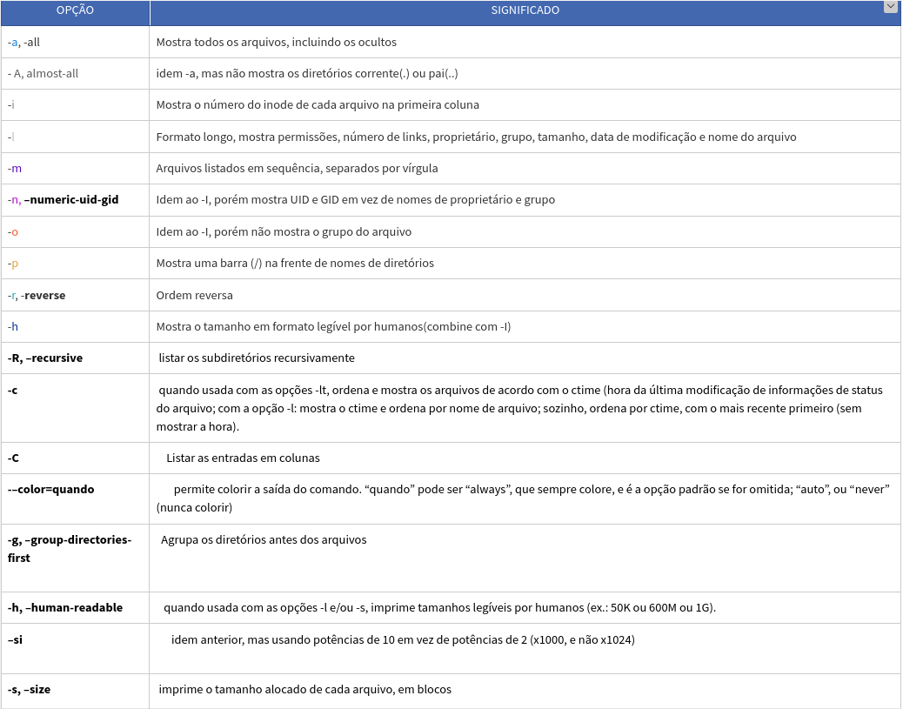
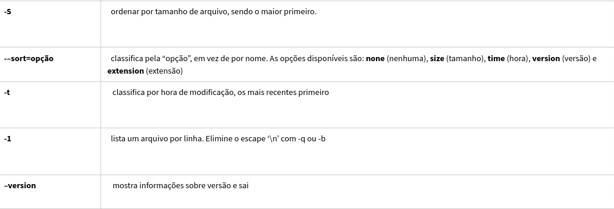
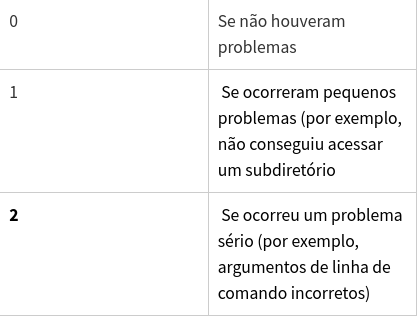

# Comando LS

Comando usado para listar arquivos em sistemas Unix ( e Linux, OS X, BSD, etc.)

Sintaxe:

```bash
ls [opções] [arquivo]
```

Usando **atalhos** do teclado. Pressione as teclas. **Ctrl + Alt + T** . Isso vai abrir o "Terminal".

# Algumas opções do ls




# Status de saída do comando ls:



