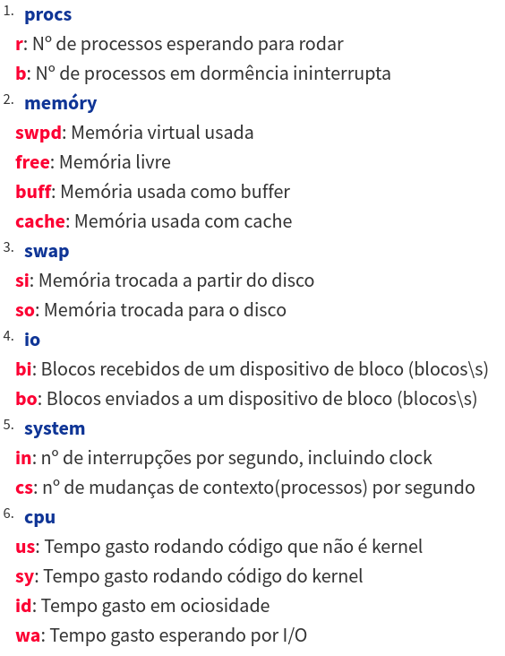

## Ferramentas essenciais
- top
- sar
- vmstat
- iostat
- free
- uptime
- dstat

# Comando top
Forneçe uma visão em tempo real do sistema em execução.

Sintaxe:
```
top [opções]
```

- **-d atraso** - Especifica o atraso em segundos entre as atualizações da tela. O padrão é 5 segundos.
- **-i** - ignora processos ociosos (processos abertos que não está mostrando nada)
- **-n num** - Exibe num iterações e depois termina.
- **-b** - Roda em modo de batch. Ùtil para mandar a saída de top para outros programas ou um arquivo.

Opções interativas:

- **h** - Gera uma tela de ajuda
- **k** - Termina um processo (será pedido seu PID)
- **q** - Sai do programa
- **r** - Modifica a prioridade de um processo (renice); Serão pedidos seu PID e valor nice (Valores positivos tem menor prioridade)
- **s** - Modifica o atraso em segundos entre as atualizações. Será peido o tempo em segundos.

Descrição dos campos de top

**PID** o PID de cada processo

**USER** Usuário proprietário do processo

**PR** Prioridade da tarefa

**NI** Valor Nice da tarefa

**VIRT** Memória virtual usada pelo processo

**RES** Memória física usada pelo processo

**SHR** Memória compartilhada usada pelo processo

**S** Estado da tarefa (**S**=sleeping, **R**=running, **T** = stopped, **Z** = sombie (processo perdido), etc.)

**%CPU %** de tempo de CPU usada pela tarefa

**%MEM %** de memória física usada pelo processo

**TIME+** Tempo total de atividade da tarefa desde que ela foi iniciada

**COMAND** nome do processo

# Comando uptime
Mostra o tempo atual, há quanto tempo o sistema está rodando, quantos usuários estão logados atualmente e as médias de carga do sistema no últimos 1, 5 e 15 minutos.

```
uptime
```

# Comando vmstat

Este comando reporta informações sobre processos, memória, paginação, blocos de I/O, traps e atividade de CPU.

Sintaxe:
```
vmstat [opções]
```

- **-SM** - Usa a unidade MB em vez do padrão KB
- **-a** - Mostra memória ativa e inativa
- **-d** - Mostra estatísticas de discos
- **-p partição** - Mostra informações de R/W na partição especificada
- **-s** - Mostra informações em formato de tabela

# vmstat - Campos



	
# Comando free
	
Exibe a quantidade de memória livre e usada no sistema
```
free [opções]
```
	
- **-b** - Mostra o uso da memória em bytes
- **-k** - idem, em KB
- **-m** - idem, em MB
- **-t** - Exibe uma linha que mostra os totais
- **-s n** - Operação contínua em intervalos de n segundos

# Comando iostat

Mostra informações sobre o uso da CPU e várias estatísticas sobre E/S do sistema.

Sintaxe:
```
iostat [opções]
```

- **-c** - Mostra apenas estatísticas da CPU
- **-d** - Mostra apenas estatísticas de I/O de disco
- **-p sda** - Mostra apenas estatísticas para sda

# Comando dstat

Permite efetuar monitoramento e verificar performance do sistema Linux, possuindo características dos comandos top, vmstat, free, iostat combinadas.

Instale-o com:
```
apt-get install dstat
```

Sintaxe:
```
dstat [opções]
```

**dstat n** - Permite ajustar o intervalo de atualização para n segundos
- **-m** - Estatísticas de uso de memória
- **-c** - Estatísticas de CPU
- **-d** - Estatísticas de disco
- **-i** - Interrupções
- **-n** - Estatísticas de uso de rede
- **--fs** - Estatísticas do sistema de arquivos
- **--ntp** - Motra a hora a partir de um servidor NTP

# Ferramentas gráficas

**gnome-system-monitor**

Ferramenta gráfica que pode ser usada para monitorar processos e desempenho do sistema

```
apt-get install gnome-system-monitor
```
