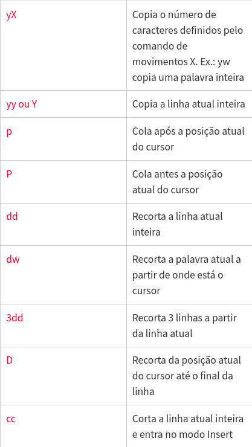
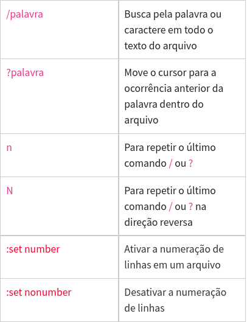

Para abrir um arquivo usando vi, basta digitar o comando vi mais o nome do arquivo. Veja:

```
vi meu-arquivo
```

- **Note que caso o arquivo não exista, será criado um novo arquivo.**

Você também pode abrir o arquivo em outros locais, por exemplo:

```
vi /home/wolmir/meu-arquivo
```


# Navegar em um arquivo usando vi


Separei uma lista com os principais comandos que permite navegar dentro de um arquivo usando vi. Veja:


# Alguns outros comandos:




# Inserir caracteres especiais


# Editar arquivo usando vi


Para editar o arquivo usando `vi` basta digitar `vi <arquivo>`, sendo que o deve ser o nome do arquivo para edição. Após abrir o arquivo, tecle `i` para entrar em **modo de edição**.


# Buscar no arquivo usando vi


Muitas vezes é importante localizar palavras ou expressões dentro do arquivo, para isso tecle `Esc` e o comando. Os principais comandos são:



# Atalhos


# Como sair do editor de texto vi


Para sair do editor, tecle `Esc` e em seguida digite:


# Obtendo ajuda no vi


